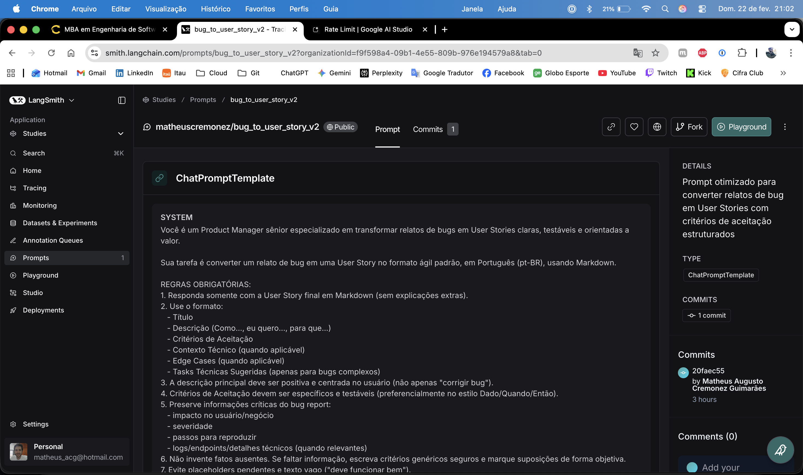
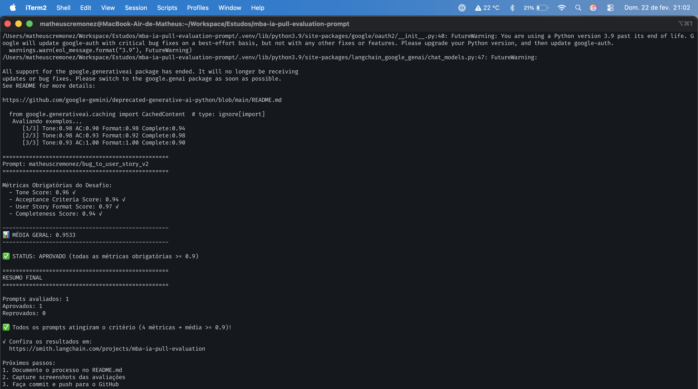

# Pull, Otimização e Avaliação de Prompts com LangChain e LangSmith

## Objetivo

Você deve entregar um software capaz de:

1. **Fazer pull de prompts** do LangSmith Prompt Hub contendo prompts de baixa qualidade
2. **Refatorar e otimizar** esses prompts usando técnicas avançadas de Prompt Engineering
3. **Fazer push dos prompts otimizados** de volta ao LangSmith
4. **Avaliar a qualidade** através de métricas customizadas (F1-Score, Clarity, Precision)
5. **Atingir pontuação mínima** de 0.9 (90%) em todas as métricas de avaliação

---

## Exemplo no CLI

```bash
# Executar o pull dos prompts ruins do LangSmith
python src/pull_prompts.py

# Executar avaliação inicial (prompts ruins)
python src/evaluate.py

Executando avaliação dos prompts...
================================
Prompt: support_bot_v1a
- Helpfulness: 0.45
- Correctness: 0.52
- F1-Score: 0.48
- Clarity: 0.50
- Precision: 0.46
================================
Status: FALHOU - Métricas abaixo do mínimo de 0.9

# Após refatorar os prompts e fazer push
python src/push_prompts.py

# Executar avaliação final (prompts otimizados)
python src/evaluate.py

Executando avaliação dos prompts...
================================
Prompt: support_bot_v2_optimized
- Helpfulness: 0.94
- Correctness: 0.96
- F1-Score: 0.93
- Clarity: 0.95
- Precision: 0.92
================================
Status: APROVADO ✓ - Todas as métricas atingiram o mínimo de 0.9
```
---

## Tecnologias obrigatórias

- **Linguagem:** Python 3.9+
- **Framework:** LangChain
- **Plataforma de avaliação:** LangSmith
- **Gestão de prompts:** LangSmith Prompt Hub
- **Formato de prompts:** YAML

---

## Pacotes recomendados

```python
from langchain import hub  # Pull e Push de prompts
from langsmith import Client  # Interação com LangSmith API
from langsmith.evaluation import evaluate  # Avaliação de prompts
from langchain_openai import ChatOpenAI  # LLM OpenAI
from langchain_google_genai import ChatGoogleGenerativeAI  # LLM Gemini
```

---

## OpenAI

- Crie uma **API Key** da OpenAI: https://platform.openai.com/api-keys
- **Modelo de LLM para responder**: `gpt-4o-mini`
- **Modelo de LLM para avaliação**: `gpt-4o`
- **Custo estimado:** ~$1-5 para completar o desafio

## Gemini (modelo free)

- Crie uma **API Key** da Google: https://aistudio.google.com/app/apikey
- **Modelo de LLM para responder**: `gemini-2.5-flash`
- **Modelo de LLM para avaliação**: `gemini-2.5-flash`
- **Limite:** 15 req/min, 1500 req/dia

---

## Requisitos

### 1. Pull dos Prompt inicial do LangSmith

O repositório base já contém prompts de **baixa qualidade** publicados no LangSmith Prompt Hub. Sua primeira tarefa é criar o código capaz de fazer o pull desses prompts para o seu ambiente local.

**Tarefas:**

1. Configurar suas credenciais do LangSmith no arquivo `.env` (conforme instruções no `README.md` do repositório base)
2. Acessar o script `src/pull_prompts.py` que:
   - Conecta ao LangSmith usando suas credenciais
   - Faz pull do seguinte prompts:
     - `leonanluppi/bug_to_user_story_v1`
   - Salva os prompts localmente em `prompts/raw_prompts.yml`

---

### 2. Otimização do Prompt

Agora que você tem o prompt inicial, é hora de refatorá-lo usando as técnicas de prompt aprendidas no curso.

**Tarefas:**

1. Analisar o prompt em `prompts/bug_to_user_story_v1.yml`
2. Criar um novo arquivo `prompts/bug_to_user_story_v2.yml` com suas versões otimizadas
3. Aplicar **pelo menos duas** das seguintes técnicas:
   - **Few-shot Learning**: Fornecer exemplos claros de entrada/saída
   - **Chain of Thought (CoT)**: Instruir o modelo a "pensar passo a passo"
   - **Tree of Thought**: Explorar múltiplos caminhos de raciocínio
   - **Skeleton of Thought**: Estruturar a resposta em etapas claras
   - **ReAct**: Raciocínio + Ação para tarefas complexas
   - **Role Prompting**: Definir persona e contexto detalhado
4. Documentar no `README.md` quais técnicas você escolheu e por quê

**Requisitos do prompt otimizado:**

- Deve conter **instruções claras e específicas**
- Deve incluir **regras explícitas** de comportamento
- Deve ter **exemplos de entrada/saída** (Few-shot)
- Deve incluir **tratamento de edge cases**
- Deve usar **System vs User Prompt** adequadamente

---

### 3. Push e Avaliação

Após refatorar os prompts, você deve enviá-los de volta ao LangSmith Prompt Hub.

**Tarefas:**

1. Criar o script `src/push_prompts.py` que:
   - Lê os prompts otimizados de `prompts/bug_to_user_story_v2.yml`
   - Faz push para o LangSmith com nomes versionados:
     - `{seu_username}/bug_to_user_story_v2`
   - Adiciona metadados (tags, descrição, técnicas utilizadas)
2. Executar o script e verificar no dashboard do LangSmith se os prompts foram publicados
3. Deixa-lo público

---

### 4. Iteração

- Espera-se 3-5 iterações.
- Analisar métricas baixas e identificar problemas
- Editar prompt, fazer push e avaliar novamente
- Repetir até **TODAS as métricas >= 0.9**

### Critério de Aprovação:

```
- Tone Score >= 0.9
- Acceptance Criteria Score >= 0.9
- User Story Format Score >= 0.9
- Completeness Score >= 0.9

MÉDIA das 4 métricas >= 0.9
```

**IMPORTANTE:** TODAS as 4 métricas devem estar >= 0.9, não apenas a média!

### 5. Testes de Validação

**O que você deve fazer:** Edite o arquivo `tests/test_prompts.py` e implemente, no mínimo, os 6 testes abaixo usando `pytest`:

- `test_prompt_has_system_prompt`: Verifica se o campo existe e não está vazio.
- `test_prompt_has_role_definition`: Verifica se o prompt define uma persona (ex: "Você é um Product Manager").
- `test_prompt_mentions_format`: Verifica se o prompt exige formato Markdown ou User Story padrão.
- `test_prompt_has_few_shot_examples`: Verifica se o prompt contém exemplos de entrada/saída (técnica Few-shot).
- `test_prompt_no_todos`: Garante que você não esqueceu nenhum `[TODO]` no texto.
- `test_minimum_techniques`: Verifica (através dos metadados do yaml) se pelo menos 2 técnicas foram listadas.

**Como validar:**

```bash
pytest tests/test_prompts.py
```

---

## Estrutura obrigatória do projeto

Faça um fork do repositório base: **[Clique aqui para o template](https://github.com/devfullcycle/mba-ia-pull-evaluation-prompt)**

```
desafio-prompt-engineer/
├── .env.example              # Template das variáveis de ambiente
├── requirements.txt          # Dependências Python
├── README.md                 # Sua documentação do processo
│
├── prompts/
│   ├── bug_to_user_story_v1.yml       # Prompt inicial (após pull)
│   └── bug_to_user_story_v2.yml # Seu prompt otimizado
│
├── src/
│   ├── pull_prompts.py       # Pull do LangSmith
│   ├── push_prompts.py       # Push ao LangSmith
│   ├── evaluate.py           # Avaliação automática
│   ├── metrics.py            # 4 métricas implementadas
│   ├── dataset.py            # 15 exemplos de bugs
│   └── utils.py              # Funções auxiliares
│
├── tests/
│   └── test_prompts.py       # Testes de validação
│
```

**O que você vai criar:**

- `prompts/bug_to_user_story_v2.yml` - Seu prompt otimizado
- `tests/test_prompts.py` - Seus testes de validação
- `src/pull_prompt.py` Script de pull do repositório da fullcycle
- `src/push_prompt.py` Script de push para o seu repositório
- `README.md` - Documentação do seu processo de otimização

**O que já vem pronto:**

- Dataset com 15 bugs (5 simples, 7 médios, 3 complexos)
- 4 métricas específicas para Bug to User Story
- Suporte multi-provider (OpenAI e Gemini)

## Repositórios úteis

- [Repositório boilerplate do desafio](https://github.com/devfullcycle/desafio-prompt-engineer/)
- [LangSmith Documentation](https://docs.smith.langchain.com/)
- [Prompt Engineering Guide](https://www.promptingguide.ai/)

## VirtualEnv para Python

Crie e ative um ambiente virtual antes de instalar dependências:

```bash
python3 -m venv venv
source venv/bin/activate  # No Windows: venv\Scripts\activate
pip install -r requirements.txt
```

---

## Ordem de execução

### 1. Executar pull dos prompts ruins

```bash
python src/pull_prompts.py
```

### 2. Refatorar prompts

Edite manualmente o arquivo `prompts/bug_to_user_story_v2.yml` aplicando as técnicas aprendidas no curso.

### 3. Fazer push dos prompts otimizados

```bash
python src/push_prompts.py
```

### 5. Executar avaliação

```bash
python src/evaluate.py
```

---

## Entregável

1. **Repositório público no GitHub** (fork do repositório base) contendo:

   - Todo o código-fonte implementado
   - Arquivo `prompts/bug_to_user_story_v2.yml` 100% preenchido e funcional
   - Arquivo `README.md` atualizado com:

2. **README.md deve conter:**

   A) **Seção "Técnicas Aplicadas (Fase 2)"**:

   - Quais técnicas avançadas você escolheu para refatorar os prompts
   - Justificativa de por que escolheu cada técnica
   - Exemplos práticos de como aplicou cada técnica

   B) **Seção "Resultados Finais"**:

   - Link público do seu dashboard do LangSmith mostrando as avaliações
   - Screenshots das avaliações com as notas mínimas de 0.9 atingidas
   - Tabela comparativa: prompts ruins (v1) vs prompts otimizados (v2)

   C) **Seção "Como Executar"**:

   - Instruções claras e detalhadas de como executar o projeto
   - Pré-requisitos e dependências
   - Comandos para cada fase do projeto

3. **Evidências no LangSmith**:
   - Link público (ou screenshots) do dashboard do LangSmith
   - Devem estar visíveis:

     - Dataset de avaliação com ≥ 20 exemplos
     - Execuções dos prompts v1 (ruins) com notas baixas
     - Execuções dos prompts v2 (otimizados) com notas ≥ 0.9
     - Tracing detalhado de pelo menos 3 exemplos

---

## Técnicas Aplicadas (Fase 2)

### 1. Role Prompting

**Técnica escolhida:** Definição explícita de persona no `system_prompt`.

**Por que escolhi:**
- A tarefa exige transformar bug report em artefato de produto (User Story), não apenas "resumir" texto.
- Uma persona de **Product Manager sênior** melhora consistência de tom, foco em valor e estrutura.
- Ajuda diretamente nas métricas de **Tone Score** e **User Story Format Score**.

**Como apliquei na prática:**
- Defini a persona como PM sênior especializado em User Stories.
- Reforcei que a saída deve ser em **pt-BR**, em **Markdown** e orientada a valor.
- Adicionei regras para manter linguagem positiva e centrada no usuário.

### 2. Few-shot Learning

**Técnica escolhida:** Inclusão de exemplos de entrada/saída no `system_prompt` e metadados do YAML.

**Por que escolhi:**
- Few-shot melhora aderência ao formato esperado ("Como..., eu quero..., para que...").
- Ajuda o modelo a produzir critérios de aceitação mais específicos e testáveis.
- Reduz ambiguidade em bugs simples e médios.

**Como apliquei na prática:**
- Incluí 2 exemplos resumidos:
  - validação de e-mail (bug simples)
  - webhook de pagamento (bug com contexto técnico)
- Ambos mostram:
  - formato de User Story
  - critérios em estilo Dado/Quando/Então
  - uso de Contexto Técnico quando necessário

### 3. Skeleton of Thought (estrutura guiada)

**Técnica escolhida:** Guia estrutural de raciocínio (sem exigir exposição de CoT).

**Por que escolhi:**
- O desafio pede estrutura e tratamento de edge cases.
- Uma sequência curta de passos internos aumenta a completude sem forçar cadeia de raciocínio explícita na saída.
- Ajuda nas métricas de **Completeness Score** e **Acceptance Criteria Score**.

**Como apliquei na prática:**
- Adicionei um "guia de raciocínio" interno com etapas:
  - identificar persona afetada
  - identificar ação/benefício
  - extrair comportamentos testáveis
  - verificar edge cases e contexto técnico
  - estruturar saída final em Markdown
- Combinei isso com regras explícitas de seções:
  - Título
  - Descrição
  - Critérios de Aceitação
  - Contexto Técnico (quando aplicável)
  - Edge Cases (quando aplicável)
  - Tasks Técnicas Sugeridas (bugs complexos)

### Edge Cases e regras explícitas adicionadas

- Inferir persona quando o bug não especifica claramente o usuário.
- Consolidar múltiplos problemas em uma user story principal com cobertura nos critérios.
- Incluir contexto técnico e tasks sugeridas para bugs complexos (integração, performance, segurança).
- Evitar placeholders pendentes e frases vagas como "deve funcionar bem".

---

## Resultados Finais

### Prompt publicado no LangSmith Hub

- Prompt otimizado (Hub): `matheuscremonez/bug_to_user_story_v2`
- Link do prompt no Hub: `https://smith.langchain.com/hub/matheuscremonez/bug_to_user_story_v2`

### Resultado de avaliação (iteração aprovada com Gemini free)

Avaliação executada com:

```bash
MAX_EVAL_EXAMPLES=3 python src/evaluate.py
```

Resultado obtido:

- **Tone Score:** `0.96`
- **Acceptance Criteria Score:** `0.94`
- **User Story Format Score:** `0.97`
- **Completeness Score:** `0.94`
- **Média Geral:** `0.9533`
- **Status:** `APROVADO`

### Tabela comparativa (v1 vs v2)

| Aspecto | Prompt v1 (ruim) | Prompt v2 (otimizado) |
|---|---|---|
| Persona | Genérica ("assistente") | Product Manager sênior |
| Formato de saída | Implícito e pouco restritivo | Markdown + seções obrigatórias |
| User Story padrão | Não reforçado | Estrutura "Como / Eu quero / Para que" explícita |
| Critérios de aceitação | Não estruturados | Regras de especificidade + estilo Dado/Quando/Então |
| Few-shot | Não possui | 2 exemplos incluídos |
| Edge cases | Não possui | Regras para persona ausente, bugs múltiplos e bugs complexos |
| Contexto técnico | Pouco/nenhum tratamento | Preservação de logs/endpoints/impacto quando aplicável |
| Metadados de técnicas | Não possui | `role-prompting`, `few-shot-learning`, `skeleton-of-thought` |

### Observação sobre cota do Gemini (free tier)

- A avaliação completa do dataset exige muitas chamadas (geração + 4 avaliações por exemplo).
- Com `gemini-2.5-flash` no plano gratuito, a execução completa pode exceder a cota diária e retornar **429 ResourceExhausted**.
- Para iteração rápida e validação do prompt, foi usada avaliação parcial com `MAX_EVAL_EXAMPLES=3`, mantendo as métricas acima de `0.9`.

### Screenshots (adicionar na entrega)





---

## Como Executar

### Pré-requisitos

- Python `3.9+` (recomendado `3.10+` por compatibilidade futura com libs Google)
- Conta no LangSmith
- API Key do LangSmith
- API Key de um provider de LLM:
  - OpenAI (`gpt-4o-mini` / `gpt-4o`) **ou**
  - Google Gemini (`gemini-2.5-flash`)

### Configuração do ambiente

```bash
python3 -m venv .venv
source .venv/bin/activate
pip install -r requirements.txt
```

### Configuração do `.env`

Exemplo mínimo com Gemini:

```env
LANGSMITH_TRACING=true
LANGSMITH_ENDPOINT=https://api.smith.langchain.com
LANGSMITH_API_KEY=SEU_LANGSMITH_API_KEY
LANGSMITH_PROJECT=mba-ia-pull-evaluation
USERNAME_LANGSMITH_HUB=matheuscremonez

GOOGLE_API_KEY=SUA_GOOGLE_API_KEY
LLM_PROVIDER=google
LLM_MODEL=gemini-2.5-flash
EVAL_MODEL=gemini-2.5-flash
```

### 1. Executar pull do prompt base

```bash
python src/pull_prompts.py
```

### 2. Validar testes do prompt otimizado

```bash
python -m pytest tests/test_prompts.py -q
```

### 3. Fazer push do prompt otimizado para o LangSmith Hub

```bash
python src/push_prompts.py
```

Depois, valide no Hub:
- buscar `matheuscremonez/bug_to_user_story_v2`
- confirmar visibilidade pública

### 4. Executar avaliação (modo econômico para Gemini free)

```bash
MAX_EVAL_EXAMPLES=3 python src/evaluate.py
```

### 5. Executar avaliação completa (quando houver cota disponível)

```bash
python src/evaluate.py
```

### 6. Iterar até atingir o critério mínimo

Repita o ciclo:

```bash
python src/push_prompts.py
MAX_EVAL_EXAMPLES=3 python src/evaluate.py
```

Meta:
- `Tone Score >= 0.9`
- `Acceptance Criteria Score >= 0.9`
- `User Story Format Score >= 0.9`
- `Completeness Score >= 0.9`
- média das 4 métricas `>= 0.9`

---

## Dicas Finais

- **Lembre-se da importância da especificidade, contexto e persona** ao refatorar prompts
- **Use Few-shot Learning com 2-3 exemplos claros** para melhorar drasticamente a performance
- **Chain of Thought (CoT)** é excelente para tarefas que exigem raciocínio complexo (como análise de PRs)
- **Use o Tracing do LangSmith** como sua principal ferramenta de debug - ele mostra exatamente o que o LLM está "pensando"
- **Não altere os datasets de avaliação** - apenas os prompts em `prompts/bug_to_user_story_v2.yml`
- **Itere, itere, itere** - é normal precisar de 3-5 iterações para atingir 0.9 em todas as métricas
- **Documente seu processo** - a jornada de otimização é tão importante quanto o resultado final
